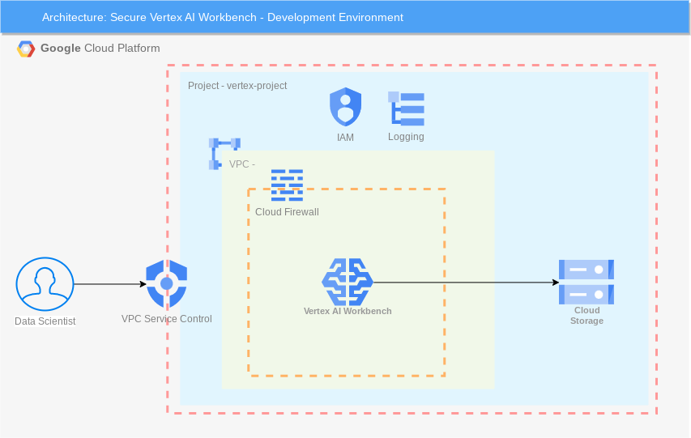

# SecureVertexWorkbench

```
This is not an officially supported Google product.
This code creates PoC demo environment for CSA Secure Vertex AI Workbench. This demo code is not built for production workload. 
```

# Demo Guide
This Cloud Security Architecture uses terraform to setup Vertex AI Wrokbench demo in a project and underlying infrastructure using Google Cloud Services like [VPC Service Controls](https://cloud.google.com/vpc-service-controls), [Cloud Firewall](https://cloud.google.com/firewall), [Identity and Access Management](https://cloud.google.com/iam), [Cloud Compute Engine](https://cloud.google.com/compute) and [Cloud Logging](https://cloud.google.com/logging).


## Demo Architecture Diagram
The image below describes the architecture of CSA Vertex AI Workbench demo to deploy a secure Workbench instance for development purposes.




## What resources are created?
Main resources:
- Project
- Organization Policies
- IAM Service Accounts
- Virtual Privacte Cloud Network and Cloud Firewalls
- VPC Service Control Permieter
- Cloud Storage Bucket
- Vertex AI Workbench Instance


## How to deploy?
The following steps should be executed in Cloud Shell in the Google Cloud Console. 

### 1. Get the code
Clone this github repository go to the root of the repository.

``` 
git clone https://github.com/JimMiller-0/SecureVertexWorkbench.git
cd SecureVertexWorkbench
```

### 2. Deploy the infrastructure using Terraform

From the root folder of this repo, run the following commands:

```
export TF_VAR_organization_id=[YOUR_ORGANIZATION_ID]
export TF_VAR_billing_account=[YOUR_PROJECT_ID]
terraform init
terraform apply
```

To find your organization id, run the following command: 
```
gcloud projects get-ancestors [YOUR_PROJECT_ID]
```


**Note:** All the other variables are give a default value. If you wish to change, update the corresponding variables in variable.tf file.


## How to clean-up?

From the root folder of this repo, run the following command:
```
terraform destroy
```